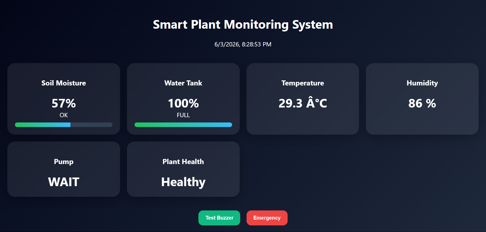
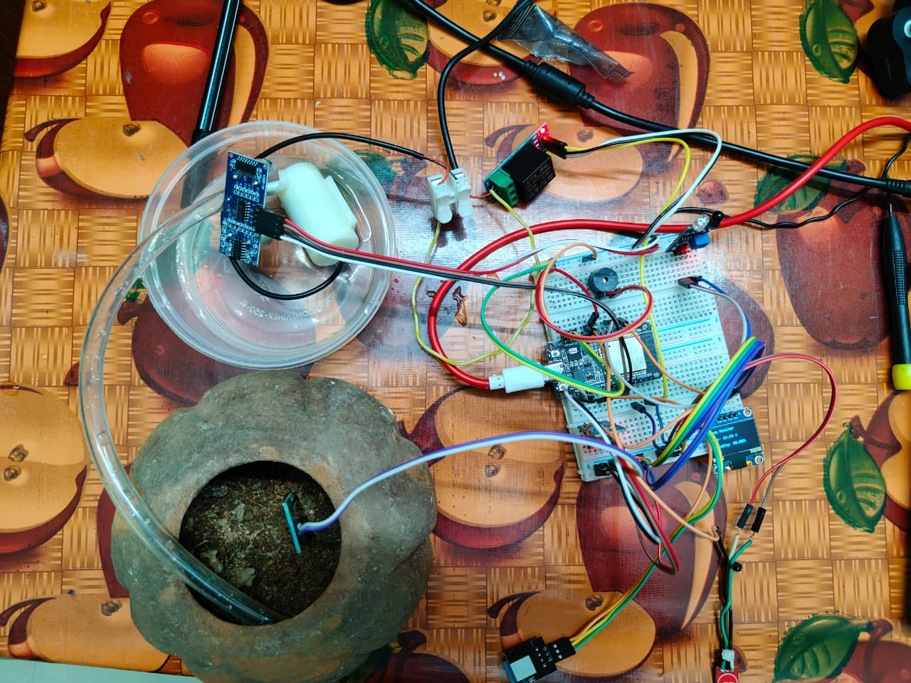
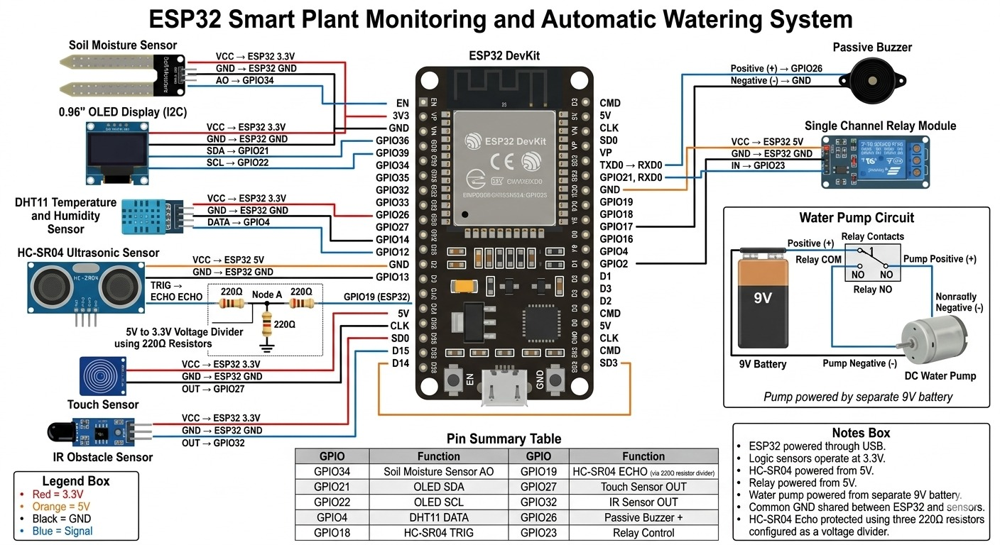

# 🌱 PlantSense - Smart Plant Monitoring & Irrigation System

<div align="center">


### Intelligent Plant Care Powered by ESP32

Monitor your plants in real-time and automate watering with a modern web dashboard.

</div>

---

## 📖 Overview

**PlantSense** is an IoT-based Smart Plant Monitoring and Irrigation System built using ESP32. The system continuously monitors soil moisture, water tank level, temperature, humidity, touch interaction, and proximity detection.

When the soil becomes dry, the system automatically activates the water pump to irrigate the plant. Users can monitor all parameters through a live web dashboard hosted directly on the ESP32.

---

## ✨ Features

### 🌿 Plant Monitoring

* Real-time Soil Moisture Monitoring
* Plant Health Status Detection
* Automatic Irrigation Control

### 💧 Water Management

* Water Tank Level Monitoring
* Low Water Level Warning
* Automatic Pump Protection

### 🌡 Environment Monitoring

* Temperature Monitoring
* Humidity Monitoring
* Live Sensor Updates

### 🤖 Smart Interaction

* Touch Sensor Response
* IR Proximity Detection
* Animated OLED Display Faces

### 🔔 Alerts & Safety

* Buzzer Alerts
* Emergency Stop Function
* Pump Protection Logic

### 📱 Web Dashboard

* Live Sensor Data
* Mobile Responsive Design
* Modern Dashboard Interface
* Emergency Controls
* Buzzer Test Function

---

## 🛠 Hardware Components

| Component                 | Quantity |
| ------------------------- | -------- |
| ESP32 Development Board   | 1        |
| Soil Moisture Sensor      | 1        |
| DHT11 Sensor              | 1        |
| HC-SR04 Ultrasonic Sensor | 1        |
| SSD1306 OLED Display      | 1        |
| Relay Module              | 1        |
| Water Pump                | 1        |
| Touch Sensor              | 1        |
| IR Sensor                 | 1        |
| Buzzer                    | 1        |
| BC548 Transistor          | 1        |

---

## 🔌 System Architecture

```text
Soil Sensor
     │
     ▼
ESP32 Controller
     │
 ┌───┼─────────────┐
 │   │             │
 ▼   ▼             ▼
OLED Dashboard   Web Dashboard
 │
 ▼
Relay Module
 │
 ▼
Water Pump
```

---

## 📊 Dashboard Preview

### Dashboard Displays

✅ Soil Moisture

✅ Water Tank Level

✅ Temperature

✅ Humidity

✅ Pump Status

✅ Emergency Status

✅ Touch Sensor Status

✅ IR Sensor Status

✅ Plant Health Indicator

---

## 📡 Wi-Fi Access Point

```text
SSID     : Smart_Plant_ESP32
Password : 12345678
```

Connect your device to the ESP32 Wi-Fi network and open:

```text
http://192.168.4.1
```

---

## 🔗 API Endpoints

### Sensor Data

```http
GET /api/data
```

Returns:

```json
{
  "soil": 65,
  "soilStatus": "OK",
  "pump": "OFF",
  "water": 80,
  "tankStatus": "FULL",
  "temperature": 28.5,
  "humidity": 70.2,
  "touch": 0,
  "ir": 1,
  "emergency": false
}
```

### Test Buzzer

```http
GET /api/buzz
```

### Toggle Emergency Mode

```http
GET /api/emergency-toggle
```

---

## ⚙ Working Principle

1. Soil moisture is continuously monitored.
2. If soil moisture falls below the threshold:

   * Water pump turns ON.
3. Water tank level is checked before irrigation.
4. If water level is too low:

   * Pump remains OFF.
   * Warning buzzer activates.
5. Sensor data is displayed on:

   * OLED Screen
   * Web Dashboard
6. Emergency mode instantly disables all watering operations.

---

## 📂 Project Structure

```text
PlantSense
│
├── plant_monitoring_system_V2.ino
├── README.md
├── Images
│   ├── dashboard.png
│   ├── circuit_diagram.png
│   └── hardware_setup.jpg
│
└── Documentation
    └── Project_Report.pdf
```

---

## 🚀 Future Improvements

* Mobile Application
* Cloud Data Storage
* Telegram Notifications
* AI-Based Plant Health Analysis
* Voice Assistant Integration
* Weather Forecast Integration
* Multiple Plant Monitoring

---
## Dashboard Preview



## Hardware Setup



## Circuit Diagram


## 👨‍💻 Developed By

**Alan Riju**

ESP32 • IoT • Embedded Systems • Smart Agriculture

---

<div align="center">

### 🌱 Making Plant Care Smarter with IoT 🌱

⭐ If you like this project, don't forget to star the repository!

</div>
